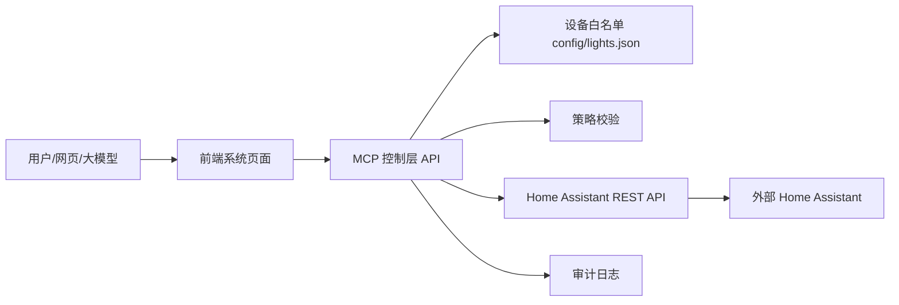

# Home Assistant MCP 控制层说明文档

## 1. 项目是做什么的

这个项目的作用很简单：

- 连接**外部的 Home Assistant**
- 在本地提供一个 **MCP 控制层**
- 再提供一个 **网页系统页面** 来查看设备和日志
- 通过白名单方式控制指定设备

**注意**

本仓库**不再启动 Home Assistant 本体**。  
Home Assistant 运行在别人的服务器或你自己的其他机器上，本项目只负责连接它并控制设备。

---

## 2. 当前运行方式

现在本项目启动后会有两个本地服务：

- **系统页面**：`http://127.0.0.1:5175`
- **MCP 控制 API**：`http://127.0.0.1:4000`

一键启动命令：

```bash
pnpm docker:dev
```

它会：

1. 检查 `.env`
2. 构建 Docker 镜像
3. 启动 MCP 后端和系统页面
4. 打印访问地址
5. 尝试自动打开浏览器

---

## 3. 目录结构一览

- `apps/log-platform`：前端系统页面
- `packages/mcp-server`：MCP 控制层后端
- `config/lights.json`：可控制设备白名单
- `start.bat` / `start.ps1`：Windows 一键启动脚本
- `docker-compose.yml`：Docker 编排文件
- `.env`：你自己的 Home Assistant 地址和 token

---

## 4. 系统整体结构



### 说明

- **前端系统页面**：看设备、看日志、点按钮控制设备
- **MCP 控制层 API**：负责校验、解析设备、调用 Home Assistant、记录日志
- **外部 Home Assistant**：真正执行设备控制
- **白名单配置**：决定哪些设备允许被控制

---

## 5. 设备是怎么管理的

设备都放在：

```text
config/lights.json
```

每个设备都用一条配置描述。比如：

对于某些墙壁开关类 `switch` 设备，如果它们在语义上实际承担的是灯路控制，也可以在 `aliases` 中补充“左右侧灯条”“前后侧灯条”“所有电灯”“关掉所有电灯”等表达，让大模型在“打开/关闭所有电灯”这类意图下能够一起命中并控制。

```json
{
  "device_id": "switch_xiaomi_w2_8263_left_switch_service",
  "display_name": "左右侧灯条",
  "aliases": ["左键", "开关左键", "墙壁开关左键", "小米开关左键", "电灯左键", "灯左键", "房间灯左键", "左右侧灯条", "左侧灯条", "左侧灯", "左灯", "左边灯", "所有电灯", "关掉所有电灯"],
  "entity_id": "switch.xiaomi_w2_8263_left_switch_service",
  "domain": "switch",
  "room": "5f_lounge",
  "type": "switch",
  "supports_brightness": false,
  "capabilities": ["turn_on", "turn_off", "get_state"],
  "risk_level": "low",
  "enabled": true
}
```

### 字段说明

| 字段 | 说明 |
|---|---|
| `device_id` | 系统内部唯一 ID |
| `display_name` | 页面上显示的名字 |
| `aliases` | 别名，方便大模型或用户识别 |
| `entity_id` | Home Assistant 实体 ID |
| `domain` | 设备域，例如 `light`、`switch`、`button`、`number`、`climate`、`sensor` |
| `room` | 所在房间 |
| `type` | 设备类型 |
| `supports_brightness` | 是否支持亮度 |
| `capabilities` | 支持哪些动作 |
| `risk_level` | 风险等级 |
| `enabled` | 是否启用 |

### 目前支持的设备域

- `light`：灯光
- `switch`：开关
- `button`：按钮
- `number`：数值实体
- `climate`：空调/温控设备
- `sensor`：传感器

系统会从 Home Assistant 状态快照里补全亮度、数值范围、温度范围、HVAC 模式、风扇模式、摆风模式和传感器单位等能力。

---

## 6. MCP 工具有哪些

工具代码在：

- `packages/mcp-server/src/tools/index.ts`
- `packages/mcp-server/src/tools/lights.ts`
- `packages/mcp-server/src/tools/switch.ts`
- `packages/mcp-server/src/tools/button.ts`
- `packages/mcp-server/src/tools/number.ts`
- `packages/mcp-server/src/tools/climate.ts`
- `packages/mcp-server/src/tools/sensor.ts`
- `packages/mcp-server/src/tools/shared.ts`

### 6.1 设备发现类

- `list_lights`：列出可用设备
- `resolve_light`：按别名或关键字匹配设备
- `list_climate_devices`：列出空调/温控设备

### 6.2 状态查询类

- `get_light_state`：查询灯光状态
- `get_switch_state`：查询开关状态
- `get_button_state`：查询按钮状态
- `get_number_state`：查询数值实体状态
- `get_climate_state`：查询空调状态
- `get_sensor_state`：查询传感器状态

### 6.3 控制类

- `turn_on_light` / `turn_off_light`：控制灯光开关
- `set_light_brightness`：设置亮度
- `set_light_state`：统一设置开/关和亮度
- `turn_on_switch` / `turn_off_switch`：控制开关
- `press_button`：按下按钮
- `set_number_value`：设置数值实体
- `set_climate_temperature`：设置空调目标温度
- `set_climate_hvac_mode`：设置空调 HVAC 模式
- `set_climate_fan_mode`：设置空调风扇模式
- `set_climate_swing_mode`：设置空调摆风模式

### 6.4 公共方法

`shared.ts` 放的是公共方法，例如：

- 请求 ID 生成
- 时间戳生成
- 状态摘要整理
- 审计日志写入

---

## 7. 分层架构说明

这套代码不是把所有逻辑写在一个地方，而是拆成了多个职责清晰的层。

### 7.1 启动装配层

对应 `packages/mcp-server/src/main.ts`。

这一层只负责启动时把各个组件拼起来：

- 读取配置
- 构建设备注册表
- 创建策略引擎
- 创建 Home Assistant 客户端
- 创建审计器
- 创建工具集合
- 启动 HTTP 服务

它属于**程序启动阶段**，不是每次用户请求都会重新执行。

### 7.2 配置与设备映射层

对应 `packages/mcp-server/src/config.ts` 和 `config/lights.json`。

这一层负责：

- 从 `.env` 读取 Home Assistant 地址和 Token
- 从 `config/lights.json` 读取设备白名单
- 把显示名、别名、`entity_id`、设备域、房间、能力等信息统一登记

它决定了系统“认识哪些设备”。

### 7.3 校验与策略层

对应 `packages/mcp-server/src/services/policy-engine.ts` 和工具内部的设备判断逻辑。

这一层负责：

- 判断设备是否存在
- 判断设备是否启用
- 判断该设备是否允许控制
- 判断某个动作是否允许执行
- 限制风险较高或不支持的操作

它相当于“门禁”和“审批员”。

### 7.4 Schema 校验层

对应 `packages/mcp-server/src/models/schemas.ts`。

这一层负责校验工具输入是否合法，例如：

- `entity_id` 是否必填
- `brightness` 是否在 0~255 之间
- `hvac_mode` 是否是允许的枚举值
- `temperature` 是否是数字

Schema 用来保证工具收到的是结构正确的参数。

### 7.5 工具层 / MCP 能力层

对应 `packages/mcp-server/src/tools/*.ts` 和 `packages/mcp-server/src/tools/index.ts`。

这一层是大模型真正能看到并调用的能力层，比如：

- `turn_on_light`
- `turn_off_light`
- `set_light_brightness`
- `turn_on_switch`
- `press_button`
- `set_climate_temperature`

工具层会编排下面几个动作：

1. 先做 Schema 解析
2. 再做设备和策略校验
3. 然后调用 Home Assistant
4. 最后读回状态并记录审计

### 7.6 Home Assistant 访问层

对应 `packages/mcp-server/src/services/ha-client.ts`。

这一层负责真正发 HTTP 请求到 Home Assistant，例如：

- `light.turn_on`
- `light.turn_off`
- `switch.turn_on`
- `climate.set_temperature`

它只负责“怎么请求 Home Assistant”，不负责业务判断。

### 7.7 HTTP 对外服务层

对应 `packages/mcp-server/src/server.ts`。

这一层把系统暴露成可访问的 HTTP 接口，供前端页面、管理后台或外部程序调用。

它包含：

- 健康检查接口
- 设备查询接口
- 设备发现接口
- 灯、开关、按钮、数值、空调的控制接口
- 日志和统计接口

### 7.8 审计与记录层

对应 `packages/mcp-server/src/services/audit-store.ts`、`packages/mcp-server/src/services/audit-logger.ts`，以及工具内部的 `writeAudit(...)`。

这一层负责：

- 记录每次调用
- 记录工具名、设备 ID、请求参数和结果
- 统计成功/失败次数
- 统计失败原因
- 便于排查问题和回放行为

### 7.9 这些层的真实执行顺序

如果从一次设备控制请求来看，更准确的顺序是：

1. 用户通过文本或语音表达需求
2. 大模型理解意图
3. 设备解析/匹配
4. 调用 MCP 工具
5. 工具内部做 Schema 校验
6. 工具内部做策略校验
7. 工具内部通过 Home Assistant 访问层发请求
8. 工具回读状态确认结果
9. 工具写入审计记录
10. 返回结果给上层

简单理解就是：

> **先理解意图，再找设备，再做校验，再执行，再确认，再记录。**

---

## 8. 对外暴露了哪些 API

真正给前端或外部调用的是 `server.ts` 里的 HTTP 接口。

### 常用接口

#### 查看健康状态

```http
GET /healthz
```

#### 查询设备白名单

```http
GET /api/admin/devices
```

#### 发现 Home Assistant 设备实体

```http
GET /api/admin/ha/entities/discover
```

#### 兼容旧灯光发现接口

```http
GET /api/admin/ha/lights/discover
```

#### 解析设备名称

```http
POST /api/control/lights/resolve
```

body：

```json
{
  "query": "开关左键"
}
```

#### 查询设备状态

```http
GET /api/control/lights/{entityId}/state
GET /api/control/switches/{entityId}/state
GET /api/control/buttons/{entityId}/state
GET /api/control/numbers/{entityId}/state
GET /api/control/climates/{entityId}/state
GET /api/control/sensors/{entityId}/state
```

#### 控制灯光和开关

```http
POST /api/control/lights/{entityId}/turn-on
POST /api/control/lights/{entityId}/turn-off
POST /api/control/switches/{entityId}/turn-on
POST /api/control/switches/{entityId}/turn-off
```

#### 按钮

```http
POST /api/control/buttons/{entityId}/press
```

#### 数值实体

```http
POST /api/control/numbers/{entityId}/value
```

#### 设置亮度

```http
POST /api/control/lights/{entityId}/brightness
```

body：

```json
{
  "brightness": 128
}
```

#### 空调/温控

```http
POST /api/control/climates/{entityId}/temperature
POST /api/control/climates/{entityId}/hvac-mode
POST /api/control/climates/{entityId}/fan-mode
POST /api/control/climates/{entityId}/swing-mode
```

---

## 9. 大模型后续怎么接入

如果后面要让大模型调用这个系统，推荐把上面的 HTTP 接口包装成模型工具。

### 9.1 工具入参 / 出参说明

下面列的是大模型在 MCP 层最常用的工具输入与输出说明。实际返回通常统一为：

- 成功：`{ success: true, data: ..., error: null }`
- 失败：`{ success: false, data: null, error: { error_code, message, details } }`

#### 灯光相关

### 推荐工具映射

- `resolve_light(query)`
- `get_light_state(entity_id)`
- `turn_on_light(entity_id)`
- `turn_off_light(entity_id)`
- `set_light_brightness(entity_id, brightness)`
- `set_light_state(entity_id, state, brightness)`
- `turn_on_switch(entity_id)`
- `turn_off_switch(entity_id)`
- `press_button(entity_id)`
- `set_number_value(entity_id, value)`
- `get_sensor_state(entity_id)`
- `set_climate_temperature(entity_id, temperature)`
- `set_climate_hvac_mode(entity_id, hvac_mode)`
- `set_climate_fan_mode(entity_id, fan_mode)`

模型先解析意图，再调用这些工具，最后由后端去访问 Home Assistant。

---

## 10. Docker 怎么启动

### 一键启动

```bash
pnpm start
```

或者：

```bash
pnpm docker:dev
```
4
这个命令会：

- 检查 `.env`
- 构建 Docker 镜像
- 启动后端和前端
- 打印访问地址
- 尝试打开浏览器

这个启动方式已经改成跨平台的 `node scripts/start-dev.mjs`，可在 Windows、macOS 和 Linux 上一致使用，不再依赖 `cmd /c start.bat`。
### 访问地址

- 系统页面：`http://127.0.0.1:5175`
- 后端健康检查：`http://127.0.0.1:4000/healthz`
- 设备列表 API：`http://127.0.0.1:4000/api/admin/devices`
- 设备发现 API：`http://127.0.0.1:4000/api/admin/ha/entities/discover`

### `.env` 示例

```env
HOME_ASSISTANT_BASE_URL=http://192.168.150.11:8123
HOME_ASSISTANT_TOKEN=your_home_assistant_long_lived_token
HOME_ASSISTANT_TIMEOUT_MS=15000
```

---

## 11. 安全边界

这个项目有几个明确限制：

- 不在前端暴露 Home Assistant token
- 不启动本地 Home Assistant 本体
- 只允许白名单内的设备被控制
- 控制后会做状态回读
- 所有动作都会写审计日志
- 亮度只对支持亮度的设备开放

---

## 12. 后续怎么加新设备

### 如果是已支持设备域

通常只要：

1. 在 `config/lights.json` 里加一条配置
2. 确认 Home Assistant 里实体存在
3. 重新启动 `pnpm docker:dev`

已支持设备域包括 `light`、`switch`、`button`、`number`、`climate`、`sensor`。

### 如果是新的设备域

比如以后要加：

- `fan`
- `scene`
- `cover`

那就需要：

1. 新增对应工具文件
2. 在 `tools/index.ts` 里组合进去
3. 在策略层放行
4. 在前端加展示

---

## 13. 一句话总结

这个项目现在的定位就是：

> **本地 Docker 启动 MCP 控制层和系统页面，连接外部 Home Assistant，按白名单控制设备。**

如果后续只是新增同类设备，基本就是 **加配置**；如果新增新的设备域，再补对应工具和策略即可。
