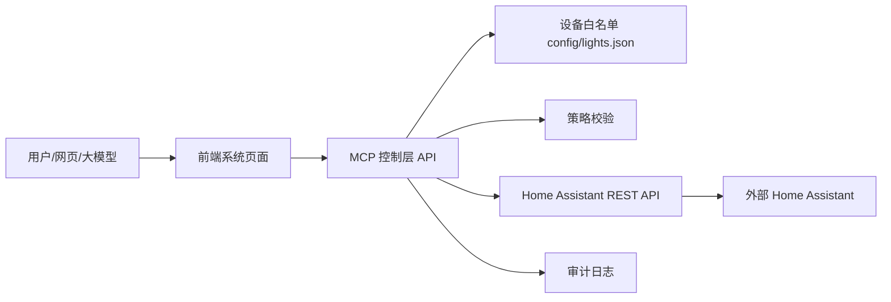

# Home Assistant MCP 控制层说明文档

## 1. 项目是做什么的

这个项目的作用很简单：

- 连接**外部的 Home Assistant**
- 在本地提供一个 **MCP 控制层**
- 再提供一个 **网页系统页面** 来查看设备和日志
- 通过白名单方式控制指定设备

**注意**

本仓库**不再启动 Home Assistant 本体**。  
Home Assistant 运行在别人的服务器或你自己的其他机器上，本项目只负责连接它并控制设备。

---

## 2. 当前运行方式

现在本项目启动后会有两个本地服务：

- **系统页面**：`http://127.0.0.1:5173`
- **MCP 控制 API**：`http://127.0.0.1:4000`

一键启动命令：

```bash
pnpm docker:dev
```

它会：

1. 检查 `.env`
2. 构建 Docker 镜像
3. 启动 MCP 后端和系统页面
4. 打印访问地址
5. 尝试自动打开浏览器

---

## 3. 目录结构一览

- `apps/log-platform`：前端系统页面
- `packages/mcp-server`：MCP 控制层后端
- `config/lights.json`：可控制设备白名单
- `start.bat` / `start.ps1`：Windows 一键启动脚本
- `docker-compose.yml`：Docker 编排文件
- `.env`：你自己的 Home Assistant 地址和 token

---

## 4. 系统整体结构



### 说明

- **前端系统页面**：看设备、看日志、点按钮控制设备
- **MCP 控制层 API**：负责校验、解析设备、调用 Home Assistant、记录日志
- **外部 Home Assistant**：真正执行设备控制
- **白名单配置**：决定哪些设备允许被控制

---

## 5. 设备是怎么管理的

设备都放在：

```text
config/lights.json
```

每个设备都用一条配置描述。比如：

```json
{
  "device_id": "switch_xiaomi_w2_8263_left_switch_service",
  "display_name": "开关左键",
  "aliases": ["左键", "开关左键"],
  "entity_id": "switch.xiaomi_w2_8263_left_switch_service",
  "domain": "switch",
  "room": "5f_lounge",
  "type": "switch",
  "supports_brightness": false,
  "capabilities": ["turn_on", "turn_off", "get_state"],
  "risk_level": "low",
  "enabled": true
}
```

### 字段说明

| 字段 | 说明 |
|---|---|
| `device_id` | 系统内部唯一 ID |
| `display_name` | 页面上显示的名字 |
| `aliases` | 别名，方便大模型或用户识别 |
| `entity_id` | Home Assistant 实体 ID |
| `domain` | 设备域，例如 `light`、`switch` |
| `room` | 所在房间 |
| `type` | 设备类型 |
| `supports_brightness` | 是否支持亮度 |
| `capabilities` | 支持哪些动作 |
| `risk_level` | 风险等级 |
| `enabled` | 是否启用 |

### 目前支持的设备域

- `light`：灯光
- `switch`：开关

`light` 一般支持亮度，`switch` 只支持开关和状态查询。

---

## 6. MCP 工具有哪些

工具代码在：

- `packages/mcp-server/src/tools/index.ts`
- `packages/mcp-server/src/tools/lights.ts`
- `packages/mcp-server/src/tools/shared.ts`

### 6.1 设备发现类

- `list_lights`：列出可用设备
- `resolve_light`：按别名或关键字匹配设备

### 6.2 状态查询类

- `get_light_state`：查询某个设备当前状态

### 6.3 控制类

- `turn_on_light`：打开设备
- `turn_off_light`：关闭设备
- `set_light_brightness`：设置亮度
- `set_light_state`：统一设置开/关和亮度

### 6.4 公共方法

`shared.ts` 放的是公共方法，例如：

- 请求 ID 生成
- 时间戳生成
- 状态摘要整理
- 审计日志写入

---

## 7. 这些工具怎么工作的

工具内部流程大致是：

1. 先从白名单里找到设备
2. 检查这个设备是否允许控制
3. 调 Home Assistant API
4. 再读一次状态，确认有没有成功
5. 把结果写进审计日志

简单理解就是：

> **先找设备，再控制，再确认，再记录。**

---

## 8. 对外暴露了哪些 API

真正给前端或外部调用的是 `server.ts` 里的 HTTP 接口。

### 常用接口

#### 查看健康状态

```http
GET /healthz
```

#### 查询设备白名单

```http
GET /api/admin/devices
```

#### 发现 Home Assistant 灯光实体

```http
GET /api/admin/ha/lights/discover
```

#### 解析设备名称

```http
POST /api/control/lights/resolve
```

body：

```json
{
  "query": "开关左键"
}
```

#### 查询设备状态

```http
GET /api/control/lights/{entityId}/state
```

#### 打开设备

```http
POST /api/control/lights/{entityId}/turn-on
```

#### 关闭设备

```http
POST /api/control/lights/{entityId}/turn-off
```

#### 设置亮度

```http
POST /api/control/lights/{entityId}/brightness
```

body：

```json
{
  "brightness": 128
}
```

#### 统一设置状态

```http
POST /api/control/lights/{entityId}/state
```

body：

```json
{
  "state": "on",
  "brightness": 180
}
```

---

## 9. 大模型后续怎么接入

如果后面要让大模型调用这个系统，推荐把上面的 HTTP 接口包装成模型工具。

### 推荐工具映射

- `resolve_light(query)`
- `get_light_state(entity_id)`
- `turn_on_light(entity_id)`
- `turn_off_light(entity_id)`
- `set_light_brightness(entity_id, brightness)`
- `set_light_state(entity_id, state, brightness)`

模型先解析意图，再调用这些工具，最后由后端去访问 Home Assistant。

---

## 10. Docker 怎么启动

### 一键启动

```bash
pnpm docker:dev
```

这个命令会：

- 检查 `.env`
- 构建 Docker 镜像
- 启动后端和前端
- 打印访问地址
- 尝试打开浏览器

### 访问地址

- 系统页面：`http://127.0.0.1:5173`
- 后端健康检查：`http://127.0.0.1:4000/healthz`
- 设备控制 API：`http://127.0.0.1:4000/api/control/lights`

### `.env` 示例

```env
HOME_ASSISTANT_BASE_URL=http://192.168.150.11:8123
HOME_ASSISTANT_TOKEN=your_home_assistant_long_lived_token
HOME_ASSISTANT_TIMEOUT_MS=15000
```

---

## 11. 安全边界

这个项目有几个明确限制：

- 不在前端暴露 Home Assistant token
- 不启动本地 Home Assistant 本体
- 只允许白名单内的设备被控制
- 控制后会做状态回读
- 所有动作都会写审计日志
- 亮度只对支持亮度的设备开放

---

## 12. 后续怎么加新设备

### 如果还是 `light` 或 `switch`

通常只要：

1. 在 `config/lights.json` 里加一条配置
2. 确认 Home Assistant 里实体存在
3. 重新启动 `pnpm docker:dev`

### 如果是新设备域

比如以后要加：

- `fan`
- `climate`
- `scene`
- `cover`

那就需要：

1. 新增对应工具文件
2. 在 `tools/index.ts` 里组合进去
3. 在策略层放行
4. 在前端加展示

---

## 13. 一句话总结

这个项目现在的定位就是：

> **本地 Docker 启动 MCP 控制层和系统页面，连接外部 Home Assistant，按白名单控制设备。**

如果后续只是新增同类设备，基本就是 **加配置**；如果新增新的设备域，再补对应工具和策略即可。
